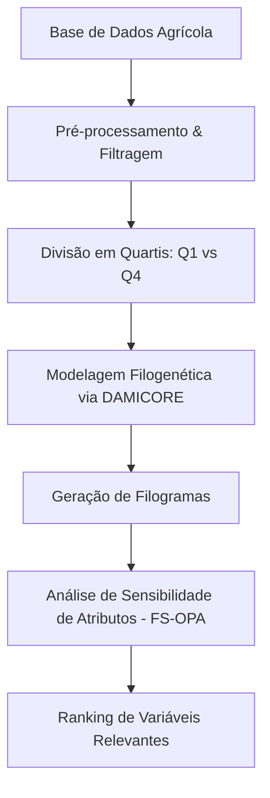

# 🌾 Análise Agrícola e Seleção de Atributos via FS-OPA

[](https://colab.research.google.com/)
[](https://www.python.org/downloads/)
[](https://opensource.org/licenses/MIT)

Este repositório contém o notebook de análise de dados agrícolas e implementação da metodologia **FS-OPA** (*Feature Sensitivity Optimization based on Phylogram Analysis*), utilizando modelagem filogenética com a ferramenta **DAMICORE** para seleção otimizada de atributos relevantes.

---

## 📌 Visão Geral

O objetivo principal deste projeto é extrair e identificar as variáveis mais influentes em bases de dados agrícolas complexas. Através do agrupamento hierárquico e da geração de filogramas, o algoritmo avalia a sensibilidade dos atributos e seleciona os fatores mais determinantes para o desempenho agrícola.

---

## ⚙️ Funcionalidades Principais

* **📂 Manipulação e Carga de Dados Agrícolas:** Importação de dados brutos (`Base2FABC.xlsx`) integrando variáveis geográficas, operacionais e meteorológicas.
* **🧬 Modelagem Filogenética (DAMICORE):** Mapeamento do perfil das amostras em árvores filogenéticas baseadas em compressão de dados.
* **🎯 Metodologia FS-OPA:** Otimização para seleção de atributos essenciais sem necessidade de conhecimento prévio (*from scratch*).
* **📊 Reamostragem por Quartis:** Agrupamento e comparação analítica do grupo de alto desempenho (1º quartil) em contraste com o de baixo desempenho (4º quartil).
* **📈 Fluxogramas e Visualização:** Mapeamento visual das etapas de processamento com integração Nativa de diagramas Mermaid.

---

## 📊 Estrutura da Base de Dados

A base utilizada (`Base2FABC.xlsx`) possui **1.496 registros** e **203 colunas**, contemplando:
* **Dados Geográficos e Administrativos:** Municípios, cooperativas, fazendas e produtores.
* **Métricas Operacionais e Temporais:** Safras, áreas cultivadas e dados operacionais.
* **Variáveis Meteorológicas:** Indicadores de radiação solar, evapotranspiração, pluviosidade e temperatura.

---

## 🔬 Fluxo da Metodologia (FS-OPA + DAMICORE)



---

## 🛠️ Pré-requisitos e Instalação

### Opção 1: Executar no Google Colab (Recomendado)
1. Clique no botão **Open in Colab** no topo deste README.
2. Monte o seu Google Drive no ambiente Colab para carregar a base `Base2FABC.xlsx`.
3. Execute as células do notebook sequencialmente.

### Opção 2: Executar Localmente
Clone o repositório e instale as dependências:

```bash
# Clonar o repositório
git clone https://github.com/seu-usuario/seu-repositorio.git
cd seu-repositorio

# Instalar dependências
pip install -r requirements.txt
```

---

## 🧰 Tecnologias Utilizadas

* **Python 3.x**
* **Pandas** — Manipulação e análise estruturada de dados.
* **DAMICORE** — Agrupamento e geração de árvores filogenéticas.
* **Google Colab / Jupyter** — Ambiente de desenvolvimento interativo.
* **Mermaid** — Documentação e diagramação do fluxo de dados.

---

## 📄 Licença

Este projeto está licenciado sob a Licença MIT — consulte o arquivo [LICENSE](LICENSE) para mais detalhes.
